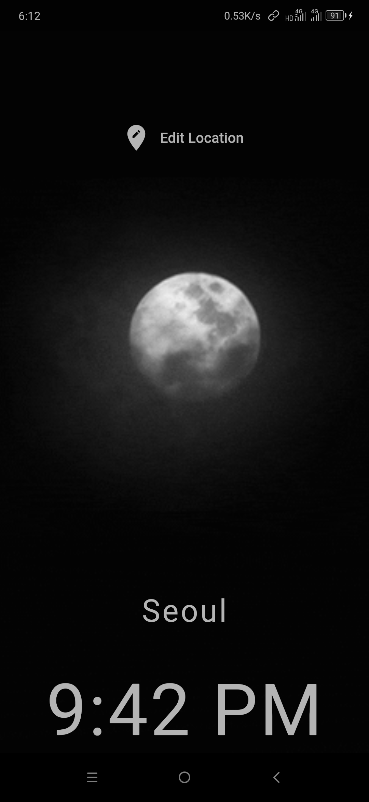

# WORLD TIME
### A flutter application to display time of different countries of the world  
   

## Intro

Learnt about the dart language and built this app in a weekend using flutter for practice.  

Features include:-
1. Times of different countries
2. Day/Night time background view based on time
3. Clean UI based on Google design guidelines
4. Loading indicator 
5. Country selection to view it's time  

## Screenshots
> Day time view

    

> Night time view

    

> Country selection view

    

## Working in brief
On initial launch of the app, a network request is made to the [worldtimeapi.]("http://worldtimeapi.org/api") Being an asynchronous event, a loading indicator is displayed while data is loaded. On success, the class is instantiated with fetched values and on failure, it is handled by logging. In the future, more focus will be made on error handling. The background is a .gif background consisting of day or time picture based on time of the selected country. 

The above process is repeated on selection of a country from the country selection screen. An obvious optimization maybe to fetch the entire countries data on intial load but that would hold true only when the number of countries to choose from are very small just like now.

## Outro
Being a practice project, it is a very simple application. Further modifications is not planned currently.

Thanks for reading!